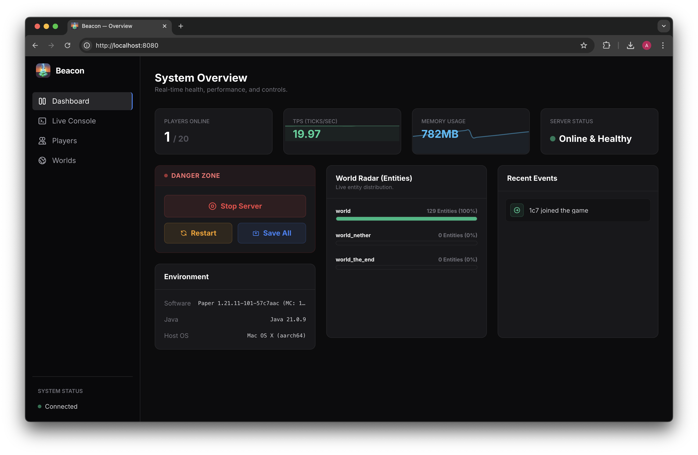
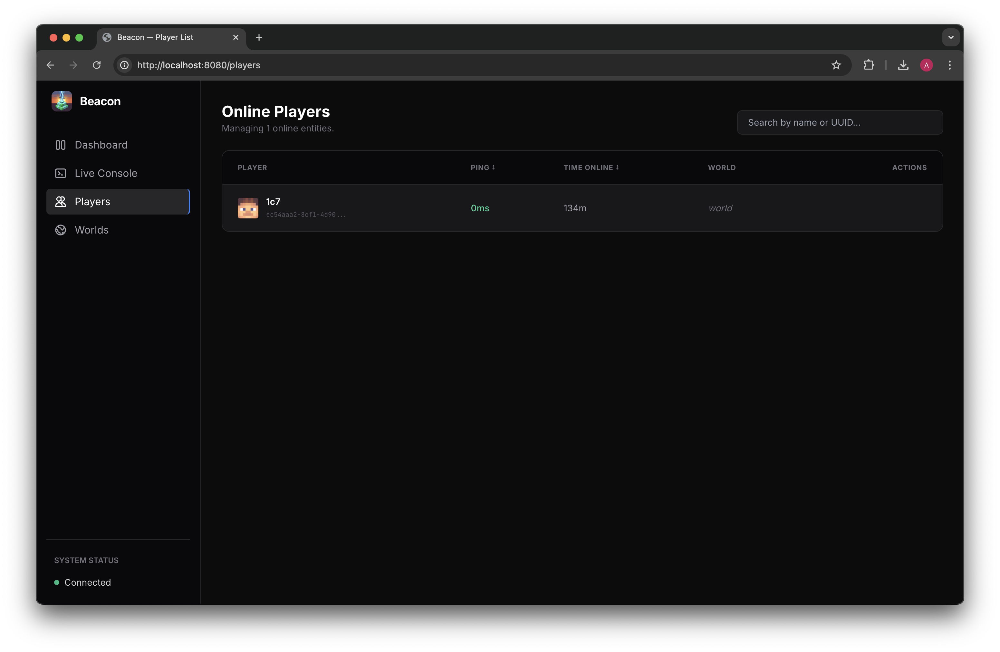
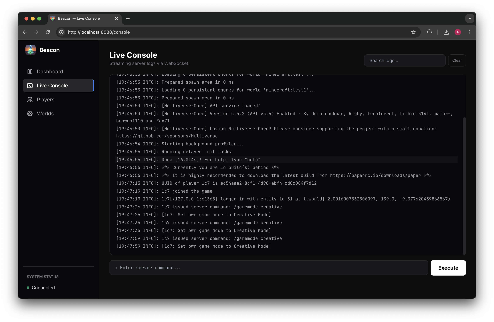

# Beacon

**Beacon** is a lightweight, real-time web monitoring and management suite for Minecraft servers. It provides server administrators with a live tap into their server's console, health metrics, world data, and player activity through a sleek, modern web dashboard.

  

---

## 🚀 Features

### 📊 System Overview (Dashboard)
The command center for your server's health and performance.
* **Live Graphs:** Real-time, animated graphs tracking Server TPS and RAM usage over the last 60 seconds.
* **Danger Zone Controls:** Send Stop, Restart, and Save-All commands directly from the UI.
* **World Radar:** A visual progress bar showing which of your top 3 dimensions is consuming the most server resources.
* **Recent Events Feed:** A cleanly filtered, color-coded feed of console high-level events.
* **Environment Info:** Instantly see your server's OS, Java version, and exact Paper build number.

### 🌍 World Manager

  

Monitor and manipulate individual dimensions on the fly.
* **Live Dimension Metrics:** View active players, loaded chunks, and entity counts per world.
* **Environment Controls:** Instantly snap the time to Day/Night or toggle the weather directly via the dashboard.
* **Time Tracking:** Watch the in-game clock tick in real-time.

### 👥 Player Management

  

A dedicated interface for monitoring and moderating your community.
* **Live Roster:** View all connected players, their ping, playtime, and dimension.
* **Quick Actions:** Hover over any player to quickly **Kick** or **Ban** them with custom reasons.
* **Visual Avatars:** Automatically pulls 3D player heads using the MC-Heads API.
* **Instant Search & Sort:** Filter players by name/UUID or sort by highest ping/playtime.

### 💻 Live Console

  

A seamless, two-way bridge to your server console.
* **Real-Time Streaming:** Console logs are streamed instantly from the server to the dashboard.
* **Log History:** The backend maintains a buffer of the last 1,000 log lines, providing full context even after refreshing the page.
* **Command Execution:** Send commands directly to the Minecraft console with full command history.
* **Smart Search:** Instantly filter the live log stream for specific keywords or player names.

---

## 🗺️ Roadmap

We are actively developing new features for Beacon.

To see what we are currently working on, suggest new features, or report bugs, please visit our **[Issue Board](https://github.com/users/adammcgrogan/projects/4)** or **[Issue Tracker](https://github.com/adammcgrogan/beacon/issues)**!