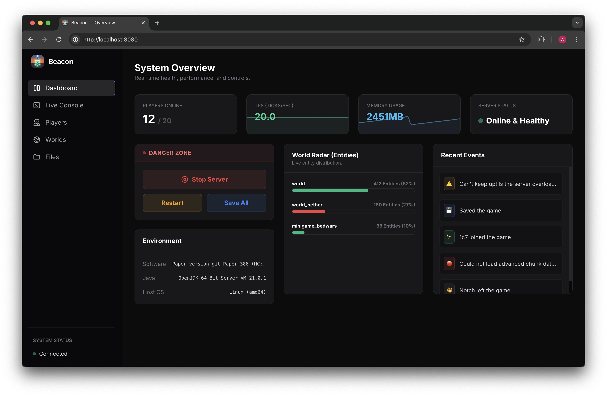
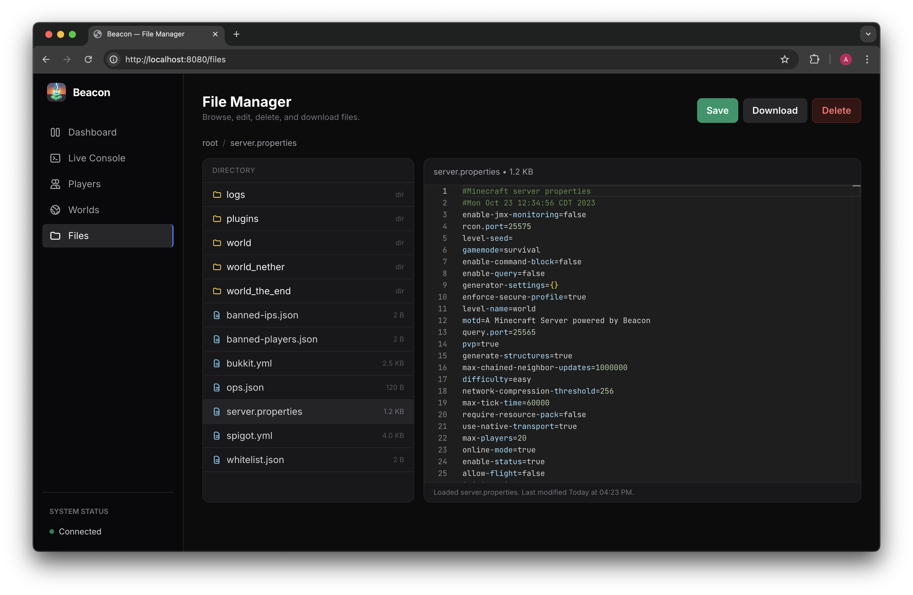
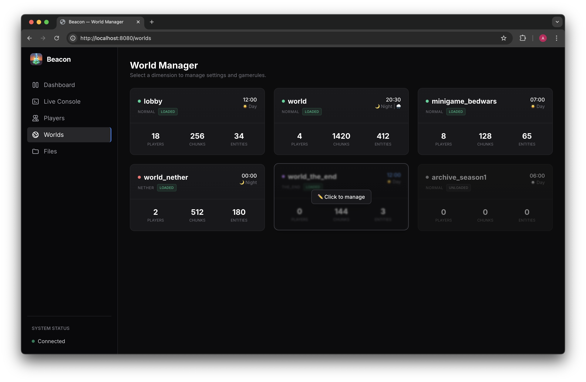

# Beacon

**Beacon** is a lightweight, real-time web monitoring and management suite for Minecraft servers. It provides server administrators with a live tap into their server's console, health metrics, world data, files, and player activity through a sleek, modern web dashboard.

---

## 🚀 Features

### 📊 System Overview (Dashboard)

  

The command center for your server's health and performance.
* **Live Graphs:** Real-time, animated graphs tracking Server TPS and RAM usage over the last 60 seconds.
* **Danger Zone Controls:** Send Stop, Restart, and Save-All commands directly from the UI.
* **World Radar:** A visual progress bar showing which of your top dimensions are consuming the most server resources.
* **Recent Events Feed:** A cleanly filtered, color-coded feed of console high-level events (joins, leaves, saves, warnings, and errors).
* **Environment Info:** Instantly see your server's OS, Java version, and exact software build.

### 📁 File Manager

  

A full-fledged file browser and code editor built right into your dashboard.
* **Web-Based Code Editor:** Edit configuration files instantly using the integrated Monaco Editor (the same powerful engine behind VS Code).
* **Full File Operations:** Browse directories, download files to your local machine, and delete files directly from your browser.
* **Breadcrumb Navigation:** Easily navigate complex plugin folder structures.
* **Real-time Saves:** Push changes live to your server with a single click or standard keyboard shortcuts (Ctrl+S / Cmd+S).

### 🌍 World Manager

  

Monitor and manipulate individual dimensions on the fly.
* **Live Dimension Metrics:** View active players, loaded chunks, and entity counts per world.
* **Interactive Gamerule Editor:** A fully searchable interface to tweak any dimension's gamerules (booleans and numerics) in real-time.
* **Environment Controls:** Instantly snap the time to Day/Night, toggle the weather, or force a world save.
* **Danger Zone:** Unload inactive dimensions to save RAM, or permanently reset a dimension completely from the UI.

### 💻 Live Console

  

A seamless, two-way bridge to your server console with advanced developer tools.
* **Real-Time Streaming:** Console logs are streamed instantly from the server to the dashboard.
* **Tab Completions:** Type commands faster with live, context-aware tab completions requested straight from the server.
* **Log Filtering & Search:** Clean up the noise by toggling INFO, WARN, or ERROR messages, or instantly search the live log stream for specific keywords.
* **One-Click Log Sharing:** Instantly upload and share a snapshot of your visible console logs using the built-in `mclo.gs` integration.
* **Spam Collapse:** Identical repeating log messages are intelligently collapsed into a single line with a multiplier badge (e.g., `x5`) to keep your feed clean.

### 👥 Player Management

  

A dedicated interface for monitoring and moderating your community.
* **Live Roster:** View all connected players, their ping, playtime, and current dimension.
* **Quick Actions:** Hover over any player to quickly **Kick** or **Ban** them with custom reasons.
* **Visual Avatars:** Automatically pulls 3D player heads using the MC-Heads API.
* **Instant Search & Sort:** Filter players by name/UUID or sort by highest ping/playtime.

---

## 🗺️ Roadmap

We are actively developing new features for Beacon.

To see what we are currently working on, suggest new features, or report bugs, please visit our **[Issue Board](https://github.com/users/adammcgrogan/projects/4)** or **[Issue Tracker](https://github.com/adammcgrogan/beacon/issues)**!